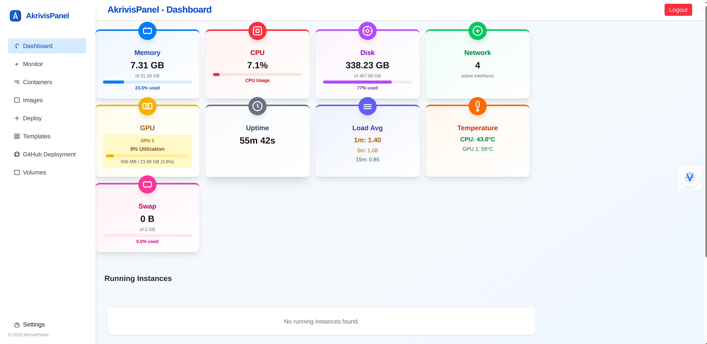
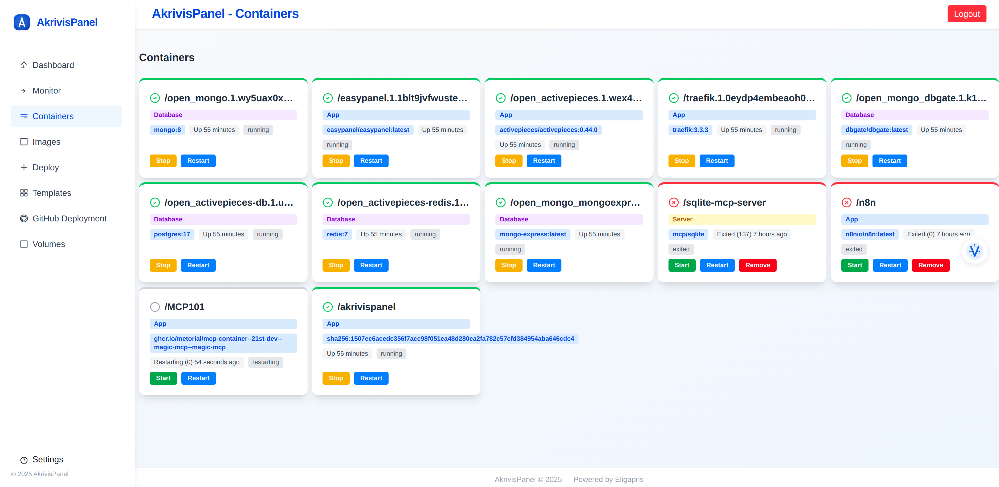
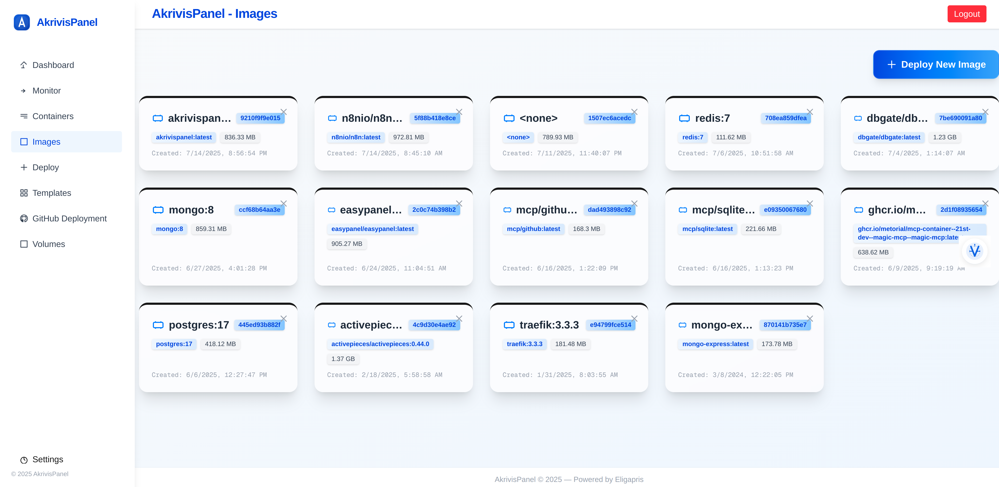
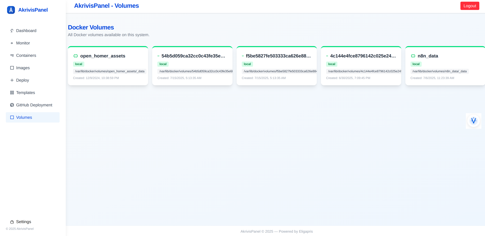
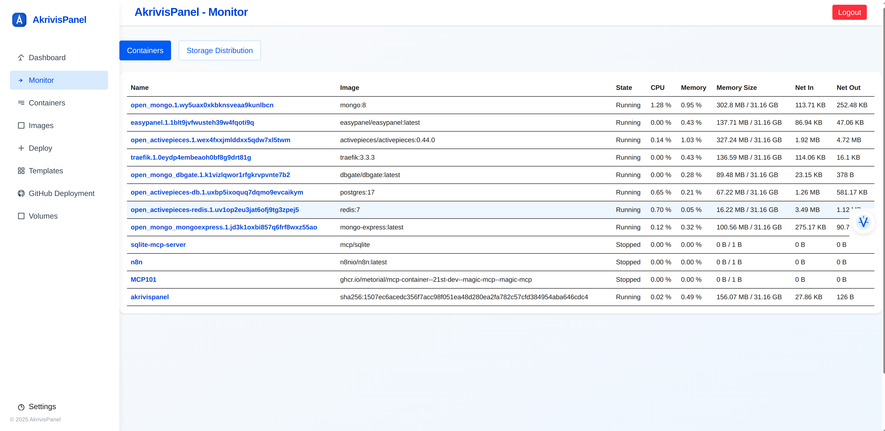
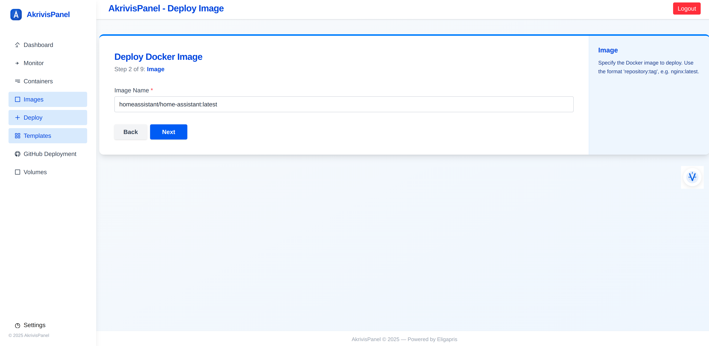
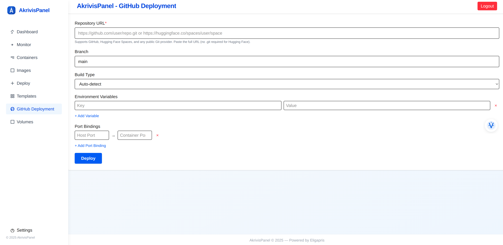
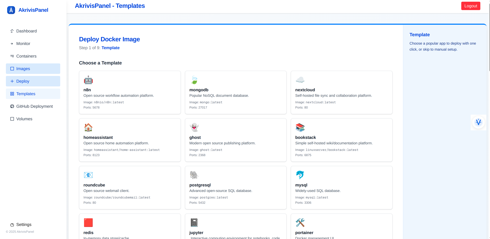

# AkrivisPanel

AkrivisPanel is a modern, open-source web panel for managing Docker containers, images, volumes, and deployments. It provides a unified, user-friendly interface for developers and teams to deploy, monitor, and manage applications on their own infrastructure—no CLI expertise required.

[](https://github.com/labKnowledge/akrivispanel)
[](https://github.com/labKnowledge/akrivispanel/stargazers)

---

## 🚀 Features

- **Unified Web UI:** Manage Docker containers, images, volumes, and networks visually.
- **One-Click Deployments:** Launch applications from GitHub, Hugging Face, Dockerfiles, Compose files, or templates.
- **Live Monitoring:** Real-time logs, resource usage, and system stats.
- **Image Management:** Pull, build, and remove images with ease.
- **Volume Management:** List, inspect, and manage Docker volumes.
- **Authentication:** Secure login system (default admin user provided).
- **Extensible:** Built with Next.js and TypeScript for easy customization and plugin support.
- **Self-Hosted:** Runs on your own infrastructure, with direct access to the Docker Engine.
- **Open Source:** MIT licensed and community-driven.

---

## 🖥️ Demo

Here are some screenshots of AkrivisPanel in action:


*The main dashboard provides an overview of your Docker environment.*


*Easily manage your containers with a user-friendly interface.*


*Pull, build, and manage Docker images effortlessly.*


*Inspect and manage your Docker volumes with ease.*


*Monitor real-time logs and system stats to keep track of your applications.*


*Deploy Docker images directly from the interface.*


*Deploy applications from GitHub and Hugging Face with ease.*


*Use templates for quick and consistent deployments.*


These screenshots showcase the intuitive design and powerful features of AkrivisPanel, making Docker management accessible to everyone.


---

## 🐳 Quick Start (with Docker)

The fastest way to get started is with Docker:

```bash
docker pull ghcr.io/labknowledge/akrivispanel
docker run -d -p 3000:3000  --gpus all -v /:/hostroot:ro -v /var/lib/docker/volumes:/var/lib/docker/volumes:ro --privileged -e HOST_ROOT=/hostroot -v /var/run/docker.sock:/var/run/docker.sock   -v akrivispanel_data:/app/data \
  --name akrivispanel \
  ghcr.io/labknowledge/akrivispanel
```

- The panel will be available at [http://localhost:3000](http://localhost:3000)
- **Docker socket is required** for full management capabilities.

### Default Login

- **Username:** `admin`
- **Password:** `agenticpanel`

> _Change the default password after first login for security!_

---

## 🛠️ Manual Installation (Development)

1. **Clone the repository:**

   ```bash
   git clone https://github.com/labKnowledge/akrivispanel.git
   cd akrivispanel
   ```

2. **Install dependencies:**

   ```bash
   yarn install
   # or
   npm install
   ```

3. **Start the development server:**

   ```bash
   yarn dev
   # or
   npm run dev
   ```

4. **Open** [http://localhost:3000](http://localhost:3000) in your browser.

---

## 🧩 Main Sections

- **Dashboard:** System overview, resource usage, and quick stats.
- **Monitor:** Live container stats, logs, and storage distribution.
- **Containers:** List, start, stop, restart, remove, and inspect containers.
- **Images:** View, pull, build, and delete Docker images.
- **Deploy:** Deploy new applications from GitHub, Hugging Face, Dockerfiles, Compose, or templates.
- **Volumes:** List and inspect Docker volumes.
- **Authentication:** Secure login/logout, with default admin user.

---

## ⚙️ Configuration

- **Port:** Default is `3000` (can be changed with Docker `-p` flag).
- **Data:** Persistent data (users, settings) stored in `/app/data` (mount a volume for persistence).
- **Docker Socket:** Mount `/var/run/docker.sock` for Docker management.

---

## 🛡️ Security

- Default credentials are for first-time setup only. Change the password immediately after logging in.
- Uses session cookies for authentication (consider using HTTPS and secure cookies in production).
- For multi-user or production environments, consider integrating with OAuth or other authentication providers.

---

## 🧑‍💻 Contributing

Contributions are welcome! Please see [CONTRIBUTING.md](CONTRIBUTING.md) (create this file if it doesn’t exist) for guidelines.

- Open issues for bugs or feature requests.
- Submit pull requests for improvements.

---

## 📚 Documentation

- **API:** RESTful endpoints under `/api/docker/` for containers, images, volumes, and deployments.
- **Extensibility:** Built with Next.js and TypeScript for easy plugin and UI extension.
- **Requirements:** See [`requirements.md`](requirements.md) for a detailed breakdown of the project’s goals and architecture.

---

## 📝 License

MIT License. See [LICENSE](LICENSE) for details.

---

## 🙏 Acknowledgements

- Built with [Next.js](https://nextjs.org/), [Dockerode](https://github.com/apocas/dockerode), and the open-source community.

---

**Repository:** [https://github.com/labKnowledge/akrivispanel](https://github.com/labKnowledge/akrivispanel)
